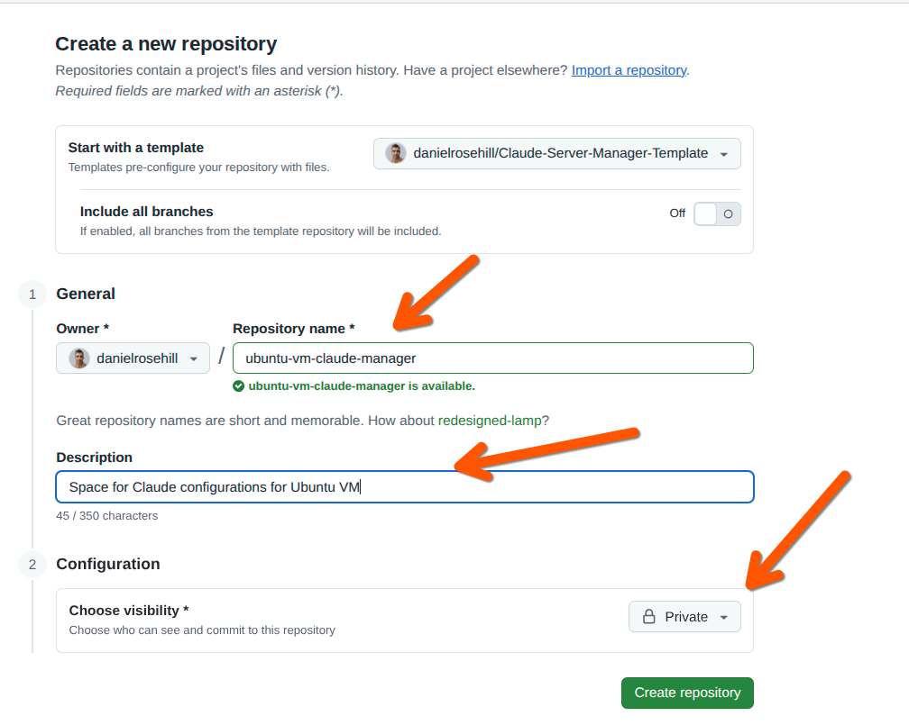
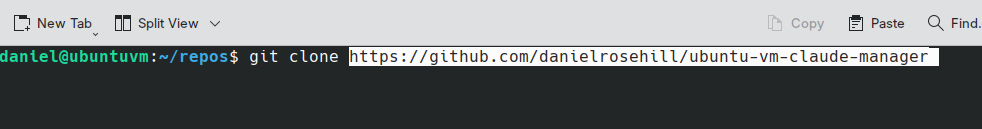
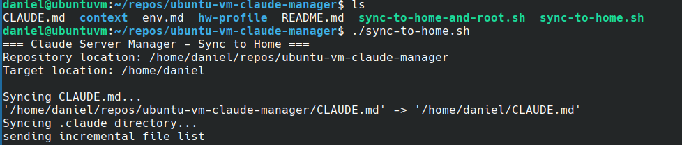
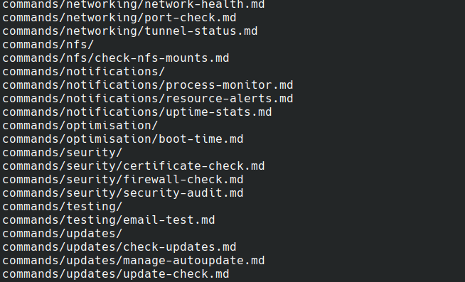
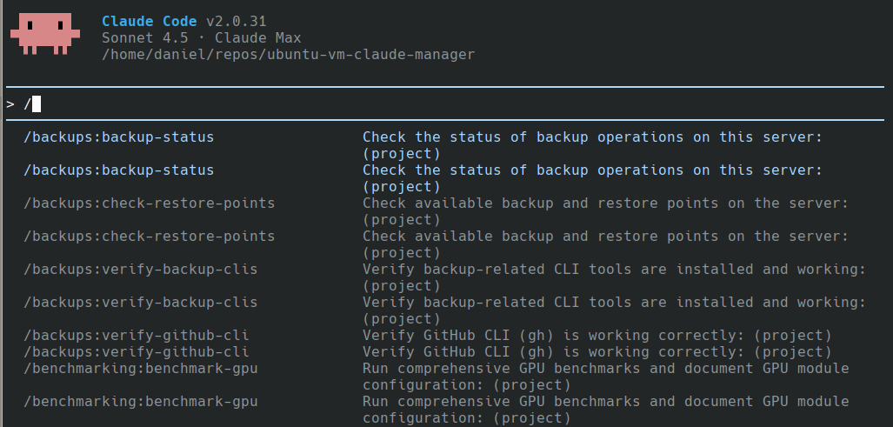

# Claude Server Manager Template

[](https://github.com/anthropics/claude-code)
[](https://github.com/danielrosehill/Claude-Code-Repos-Index)
[](https://github.com/danielrosehill/Github-Master-Index)

A template repository for deploying Claude Code configuration to home servers. This template was created based on my specific server environment and use cases, so you'll want to customize it for your own setup.

# Important: Customization Required

**Important:** This repository provides a pattern and starting point - it should not be deployed without customization. It was created based on my specific server environment and is intended as a model to demonstrate the approach.

Before deploying, you will need to:

- **Tailor `CLAUDE.md`** - Rewrite this file entirely for your environment. Include your server's purpose, hardware specs, services, directory structures, and specific use cases. This file is what gives Claude context about YOUR system.
- **Remove many slash commands** - The 38 included commands are specific to my setup. Review them carefully and remove those that don't apply to your environment. Keep or adapt only what's relevant.
- **Update network details** - IP addresses (10.0.0.x), LAN structure, and services references are specific to my network.
- **Adjust resource context** - References to low-spec hardware (i3 CPU, GTX 1050Ti) and resource conservation should be updated or removed based on your actual hardware.
- **Modify directory paths** - Update paths for Docker deployments, backups, and other services to match your filesystem organization.

This repository demonstrates the pattern of creating a comprehensive Claude Code environment for server administration. Use it as a reference and starting point, but customize it thoroughly for your own needs.

# Suggested Setup Workflow

## Create private repo from this template

Create a private repository from this template for each machine you wish to manage.



## Clone and sync commands

Clone your copy on the remote:



Run the propagation script to copy in the slash commands, CLAUDE.md and subagents:



Files should copy in an instant:



Slashes are now available:



---

# Purpose

This template provides a comprehensive Claude Code environment optimized for server administration tasks. It includes:

- Custom `CLAUDE.md` with server-specific context and instructions
- **38 slash commands** for routine system administration tasks
- **10 specialized agents** for complex management workflows
- Hardware profiling directory structure

### Key Features

- **Low-spec hardware optimization** - Resource monitoring and performance tuning
- **Docker deployment management** - Atomic deployment pattern with Git integration
- **Cloudflare Tunnel integration** - External service exposure and monitoring
- **Advanced storage management** - XFS, RAID, NAS, and cloud object storage
- **Comprehensive monitoring** - System health, services, logs, and security
- **Backup orchestration** - Status monitoring and troubleshooting
- **Proxmox VM integration** - VM management from host perspective

## Deployment Model

Clone this repository anywhere on your managed server, then use the provided sync scripts to deploy the configuration files where Claude Code expects them.

### Quick Start

```bash
# 1. Clone the repository
cd ~/repos/github  # or wherever you keep repositories
git clone https://github.com/danielrosehill/Claude-Server-Manager-Template.git
cd Claude-Server-Manager-Template

# 2. Deploy the template files
# Choose your deployment method:

# Option A: Sync to home directory only
./sync-to-home.sh

# Option B: Sync to both home directory AND / (requires sudo)
./sync-to-home-and-root.sh

# 3. Run the setup wizard
claude  # Start Claude Code
# Then run: /claude-setup
```

**Important First Step:** After deploying, run the `/claude-setup` slash command. This interactive wizard will ask you questions about your environment and help you:
- Customize `CLAUDE.md` for your server
- Remove irrelevant slash commands
- Identify which agents to keep or remove
- Update network references and paths
- Tailor the entire configuration to your needs

Don't skip this step - the template is designed to be heavily customized!

### Deployment Options

**Option A: `sync-to-home.sh`**
- Deploys to `~/CLAUDE.md` and `~/.claude/`
- No sudo required
- Use when Claude Code will be run from your home directory
- Creates symlink for `~/hw-profile` to the repository

**Option B: `sync-to-home-and-root.sh`**
- Deploys to both `~` and `/` (filesystem root)
- Requires sudo for copying to `/`
- Use when you want Claude Code available system-wide
- Useful for running Claude Code with elevated privileges
- Creates configuration at `/CLAUDE.md` and `/.claude/`
- Creates `hw-profile` symlinks for both locations

### How It Works

The sync scripts:
1. Copy `CLAUDE.md` and `.claude/` from the repository to the target location(s)
2. Use `rsync --delete` to ensure `.claude/` stays in sync
3. Create symlinks for `hw-profile/` directory back to the repository
4. Can be run repeatedly to update the configuration after making changes

This approach allows you to:
- Keep the repository under version control in a normal location
- Update configurations by editing the repo and re-running the sync script
- Maintain separation between the repository and deployment locations
- Use Git workflows (branches, PRs) for configuration management

### Setup Steps

1. Clone the repository to your preferred location
2. Run the appropriate sync script based on your needs
3. Ensure Claude Code CLI is installed and authenticated on the server
4. Run `claude` from anywhere to use the server management commands

### Updating Configuration

After making changes to the repository:
```bash
cd /path/to/Claude-Server-Manager-Template
git pull  # if pulling updates
# Make your changes...
./sync-to-home.sh  # or sync-to-home-and-root.sh
```

## Included Slash Commands

Use these commands by typing them in Claude Code CLI:

### System Health & Monitoring
- `/system-health` - Check disk space, memory, CPU, and system status
- `/uptime-stats` - Check system uptime and stability metrics
- `/boot-time` - Analyze boot time and identify slow-starting services
- `/check-services` - Review systemd service status and identify failures
- `/check-logs-noteworthy` - Review logs for anything noteworthy (not just errors)
- `/analyze-logs` - Examine system and service logs for errors
- `/resource-alerts` - Check resource pressure and alerts (critical for low-spec hardware)
- `/process-monitor` - Identify and analyze resource-intensive processes

### Storage & Filesystem
- `/disk-usage` - Analyze disk space consumption and identify space hogs
- `/filesystem-health` - Check filesystem health and integrity (XFS)
- `/cleanup-filesystem` - Identify old/leftover files for cleanup (requires approval)
- `/xfs-check` - XFS-specific filesystem health and performance checks
- `/raid-status` - Check multi-disk array and RAID status

### Docker Management
- `/docker-health` - Comprehensive Docker health check
- `/prune-docker` - Review running containers and identify resource usage
- `/cleanup-docker` - Identify inactive Docker deployments for removal (requires approval)
- `/check-docker-permissions` - Verify Docker volume and data directory permissions
- `/deployment-list` - List and analyze all Docker deployments
- `/volume-check` - Check Docker volume configuration and health

### Networking & Connectivity
- `/network-health` - Check network configuration and connectivity
- `/check-lan-connectivity` - Verify connectivity to key LAN systems
- `/check-nfs-mounts` - Check NFS mounts and NAS availability
- `/tunnel-status` - Check Cloudflare tunnel status and connectivity
- `/port-check` - Analyze port usage and listening services

### Security & Certificates
- `/security-audit` - Conduct comprehensive security audit
- `/firewall-check` - Assess firewall configuration and security posture
- `/certificate-check` - Check SSL/TLS certificate status and expiration

### Backups & Notifications
- `/backup-status` - Verify recent backup operations and check for failures
- `/verify-backup-clis` - Check backup CLI tools (rclone, aws, etc.)
- `/email-test` - Test email notification system

### Hardware & Virtualization
- `/gpu-status` - Check GPU passthrough and NVIDIA GPU status
- `/proxmox-status` - Check this VM's status from Proxmox host perspective

### System Maintenance & Updates
- `/check-updates` - Check for available system updates and security patches
- `/manage-autoupdate` - Review and configure automatic update settings
- `/verify-github-cli` - Verify GitHub CLI is working correctly

### Documentation & Profiling
- `/document-distro` - Document Linux distribution and system info (saves to context/)
- `/benchmark-hardware` - Comprehensive hardware benchmarking (saves to hw-profile/)
- `/benchmark-gpu` - GPU and compute module benchmarking (saves to hw-profile/)
- `/check-restore-points` - Check available backup and restore points

## Included Subagents

Specialized agents for complex administrative tasks (use via Task tool):

### Core Operations
- **docker-troubleshooter** - Diagnose and resolve Docker-related issues
- **backup-manager** - Manage, troubleshoot, and optimize backup operations
- **log-analyzer** - Examine system and application logs for issues and patterns
- **service-monitor** - Monitor and troubleshoot systemd services
- **security-auditor** - Perform security checks and vulnerability identification

### Advanced Management
- **performance-optimizer** - Optimize resource usage for low-spec hardware
- **deployment-manager** - Manage Docker deployments following atomic deployment principle
- **tunnel-manager** - Manage and troubleshoot Cloudflare Tunnel connectivity
- **storage-manager** - Manage XFS filesystems, RAID arrays, NAS, and cloud storage

### Documentation
- **server-documentarian** - Create comprehensive documentation for debugging operations, server configuration, bug reports, and work logs

## Directory Structure

- `.claude/` - Claude Code configuration and commands
- `context/` - Server context documentation (distro info, configuration)
- `hw-profile/` - Hardware and GPU benchmark reports

## Use Case

Ideal for Ubuntu servers running:
- Docker containerized services
- Automated backup operations
- Local network services
- Development/testing environments

## Security Note

This template is designed for home lab and development servers. Adjust permissions and security settings appropriately for your environment.
